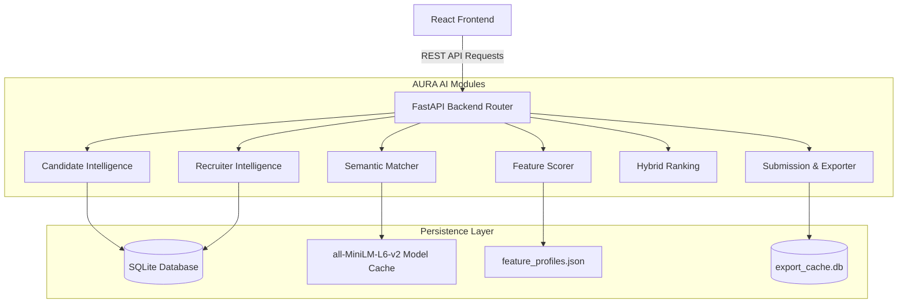

# System Architecture Document — AURA AI

## 1. System Overview
AURA AI is built on a decoupled, three-tier service-oriented architecture designed to handle high-throughput candidate evaluation. It consists of a React-based single-page application (SPA) client, a FastAPI-based RESTful API server, and SQLite storage for relational candidate and audit logs.

---

## 2. High-Level Architecture Diagram

---

## 3. Communication Patterns
*   **Synchronous Execution:** Heuristic DOCX uploading, candidate list paginated queries, and configuration updates are blocking HTTP transactions.
*   **Asynchronous Rebuilds:** Model embedding generations, feature evaluations, and final cache ranking calculations run in non-blocking event loops or thread pools (`asyncio.to_thread`) to maintain API responsiveness.
*   **Inter-Module Boundaries:** Modules interface strictly through Pydantic DTO models and Service methods. Direct database joins across domain boundaries are forbidden.

---

## 4. Caching & Logging Strategy
*   **Semantic Layer:** Stores candidate embedding matrix as unit-normalized NumPy arrays on disk.
*   **Feature Layer:** Persists pre-calculated scorecards in `feature_profiles.json` to allow incremental updates.
*   **Ranking Layer:** Stores active weight rankings in an in-memory dictionary.
*   **Logging:** Powered by Loguru. Synchronous transactions log structured diagnostic contexts, while background pipelines record execution statistics (throughput rate, candidates per second).
